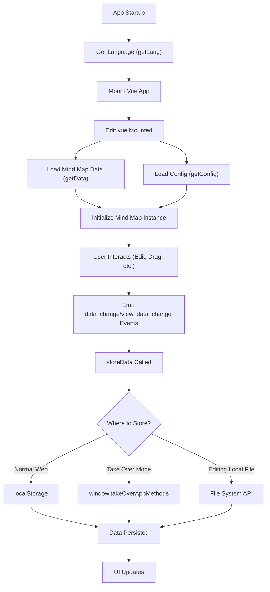
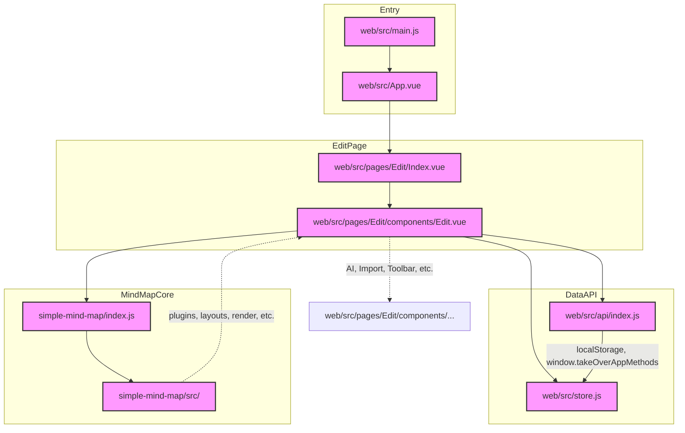

# Main call/Logic flow

```mermaid
flowchart TD
    A["App Startup"] --> B["Get Language (getLang)"]
    B --> C["Mount Vue App"]
    C --> D["Edit.vue Mounted"]
    D --> E["Load Mind Map Data (getData)"]
    D --> F["Load Config (getConfig)"]
    E & F --> G["Initialize Mind Map Instance"]
    G --> H["User Interacts (Edit, Drag, etc.)"]
    H --> I["Emit data_change/view_data_change Events"]
    I --> J["storeData Called"]
    J --> K{Where to Store?}
    K -- "Normal Web" --> L["localStorage"]
    K -- "Take Over Mode" --> M["window.takeOverAppMethods"]
    K -- "Editing Local File" --> N["File System API"]
    L & M & N --> O["Data Persisted"]
    O --> P["UI Updates"]
```

# logic with files about core data flow

```mermaid
flowchart TD
    subgraph Entry
        A[web/src/main.js] 
        B[web/src/App.vue]
    end

subgraph EditPage
    C["web/src/pages/Edit/Index.vue"]
    D["web/src/pages/Edit/components/Edit.vue"]
end

subgraph DataAPI
    E["web/src/api/index.js"]
    F["web/src/store.js"]
end

subgraph MindMapCore
    G["simple-mind-map/index.js"]
    H["simple-mind-map/src/"]
end

%% Entry point
A --> B
B --> C

%% Edit page loads main editor
C --> D

%% Edit.vue loads and saves data via API
D --> E
D --> F

%% Edit.vue creates MindMap instance (core logic)
D --> G
G --> H

%% DataAPI uses localStorage, Vuex, or "take over" interface
E -->|"localStorage, window.takeOverAppMethods"| F

%% MindMapCore is the core mind map logic and rendering
H -.->|"plugins, layouts, render, etc."| D

%% Optional: AI/Import/Toolbar
D -.->|"AI, Import, Toolbar, etc."| I["web/src/pages/Edit/components/..."]

%% Notes
classDef main fill:#f9f,stroke:#333,stroke-width:2px;
class A,B,C,D,E,F,G,H main
```